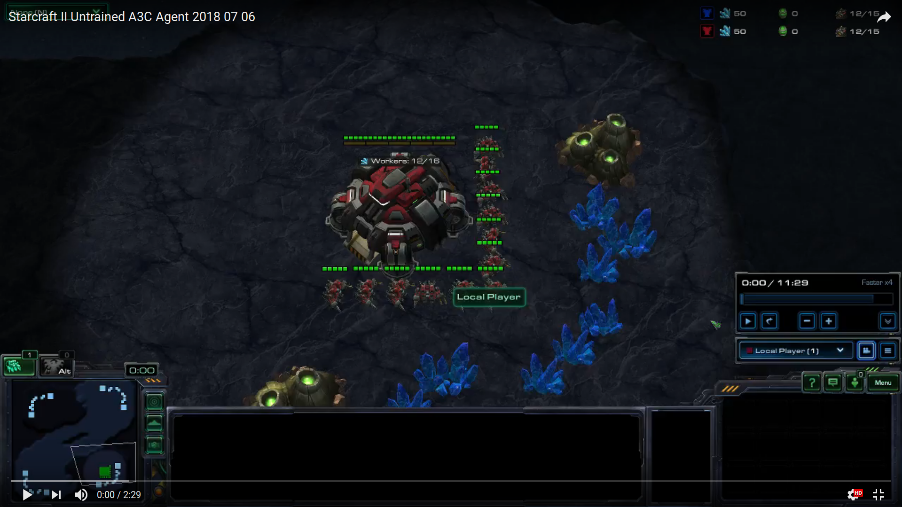
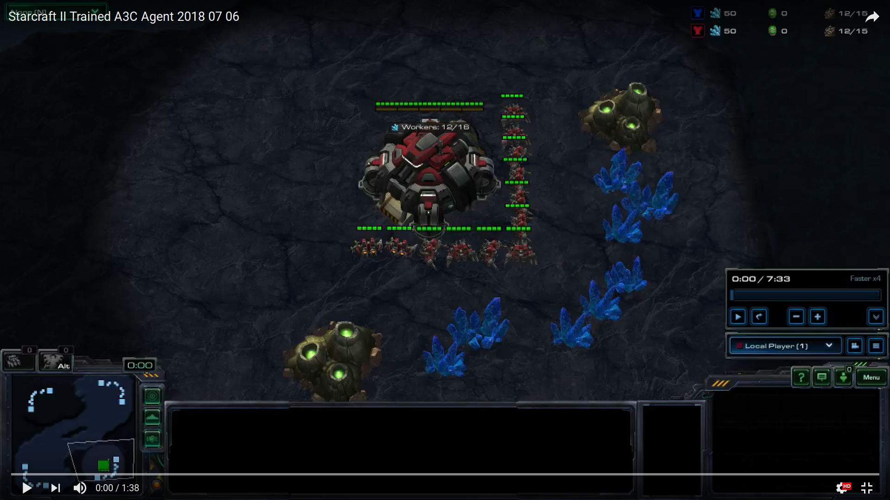

# Starcraft II A3C learning agent

## First off, credits go to Steven Brown, https://github.com/skjb for the PySC2 tutorial and code, and Jaromir, https://github.com/jaara for the A3C tutorial and code for the implementation of the A3C agent.  

As is, PySC2 branch version 7a04e74 is installed via anaconda on Ubuntu 16.04.  Starcraft II client is 3.16.1 on Ubuntu.  Branch has been modified to support the learning Agent.  This is a work in progress and the AI can be started by way of calling ``` python deepmind_api_modified/pysc2/bin/agent.py ``` This hasn't been tested on other systems and may not work.  Updates will come relatively frequently as this is updated.

**What's Your Project**

Starcraft II Asynchronous Advantage Actor Critic reinforcement learner for PySCII API version 1.1

**What's The Problem?**

Given the complexity of the game, it represents a testbed for testing reinforcement learning artificial intelligence, and given the complexity, it is expected that a successful AI will be revolutionary.  In particular, a well-known name in AI and especially reinforcement learning, DeepMind is taking a forefront position by developing APIs to give a computer agent access to play the game.  So far, progress by DeepMind has been tight-lipped with few publications apart from the initial statement of using Starcraft II as a testbed for developing AI, but the APIs have been released to the public and projects have been encouraged.  

Starcraft II is a game that I have played for 8 years, from the closed beta for Wings of Liberty to the current expansion Legacy of the Void.  At my peak play level, I was Master I (within top 1% of players) but still 100's of times below the level of a top pro player.  So, I'm very excited to delve deeper into the world of reinforcement learning, commonly regarded to be the possible holy grail of AI in terms of having the potential to be a general learner, and work with the game that I have played for a long time to possibly make a 'best in the world' player and do the same thing that AI has done to games like Chess and Go.  

The beauty of the reinforcement learner problem is that a good reinforcement learner should be able to learn the game without any programmer domain knowledge and because of that be able to teach itself without any domain specific hacks and also find it's own novel solutions to problems that humans haven't thought of yet.  

**How Did You Do It?**

The starting point of this project is not gathering data, unlike many other data-science projects.  Since reinforcement learners can learn from their past actions, and the API at this time did not support loading in of replays for imitation learning, despite the fact that large replay datasets did exist, I was unable to make use of those and had to focus on pure reinforcement learning.  The starting point was learning the software stack that I had to use, ie. the API.  APIs exist for C++, Javascript, and Python.  My only known language is Python so choosing an API was simple.  Due to the nature of the game development, there was an initial API built so that the game could process bot inputs built on Google's Protocool Buffers extensible mechanisms.  This is the C++ API and all others were built on top of this.  This led to a less than neat design to the code, and such that it was and still is in very active development, an understanding of the code took some time.  Fortunately, there was a major resource in the form of Steven Brown's tutorials in which he took the Python API and built a deep Q-learning agent in a limited action pool.  This is in part, a basis of the action pool the current iteration of my bot uses.  

I had initially planned on spending one of the two weeks building out a robust action pool for the bot to work off.  Unfortunately, after the week was mostly spent, I was struggling with some of the technical limitations of the current version of the API, the largest issue being how data is passed to the bot.  The bot sees the landscape from a top down view with 23 layers of arrays that each contain a different 'slice' of data.  This is useful for many applications; however, individual unit IDs were not implemented to be used by the agent at this time, and so to give orders to the economy based SCVs that have the ability to either mine Mineral Crystals or Vespene Gas (both being essential resources to buy buildings and units in the game), while it was relatively simple to keep SCVs mining the more essential of the resources, Mineral Crystals, by randomly selecting pixels identified as SCVs and sending them to Mineral Crystals, if Vespene Geysers were allowed to be mined, all of the SCVs would eventually be clumped on the Vespene Geysers, either leading to game crashes, or all the SCVs on the Geyser and none on Minerals.  A solution could possibly be creating a machine vision agent whose sole purpose is to tag individual units, but this task would be an entire project in itself.  In the end, given that Minerals are the more essential resource (All the most basic, essential units and buildings use only Minerals), I simply expanded the action pool to allow more basic things to be built so that I could focus on the agent (the brain and learning component) itself.  

In Steven Brown's tutorial, Deep Q-Learning was implemented from Morvan Zhou (https://github.com/MorvanZhou).  I won't touch on Q-Learning or Deep Q for the sake of brevity since this 'short' project description is already going larger than expected, however feel free to check out Morvan's Github, it is a collection of very thorough ANN tutorials.  I needed to replace this agent.  In the past year, DeepMind has published a very interesting Reinforcement Learning Agent called Asynchronous-Advantage-Actor-Critic, aka A3C.  While researching the different types of Reinforcement Learning NNs, I stumbled upon A3C, and consequently a tutorial on A3Cs by Jaromir (https://github.com/jaara).  This is the basis for the A3C agent implemented into the bot.  A3C builds on Advantage-Actor-Critic.  As you may have guessed if you familiar with other adversarial type NNs like GANs (Generative-Adversarial-Networks), the Actor and Critic each represent a NN, each fighting each other.  In essense, in an A2C, the Actor is similar to a Deep Q-Net in that where a DQN approximates Q(s,a), the goodness of a single state (s) and action (a) in a finite set of action, state pairs, we can say that there is a policy (pi) which is a function of the state (s), which we can approximate.  The NN will will take a state (s) and give a policy (pi) as an action-probability distribution where the probabilities represent success-rates of an action (a) taken at state (s).   At this point, given the goal of the Reinforcement Learner is to improve, we want to look for the best policy in an iterative process of finding policies better then the current policy.  Using the Policy Gradient Theorem, we can record our environment in terms of state (s), action (a), reward (r), and new_state(s') to build up an approximation of the policy gradient.  The (s,a) valuations are scalar vectors relative to each other and the Actor-Critic itself is defined as A(s,a) = Q(s,a) - V(s) where A(s,a) is the scalar vector output of (s,a) pairs, Q(s,a) is the Actor, and V(s) is the Critic, or the normalizing function which produces the scalar values where we see that better actions than the mean have higher values and worse actions than the mean have lower values.  Essentially, the goal of Q(s,a) or the policy (pi) is optimising policy and is the Actor, and the goal of V(s) or the value function as the Critic is continually estimating the value function to increase precision.  This is A2C.

A3C arises from the problem that agent runs are highly correlated, and we run into issues.  To minimise correlation, multiple agent are run in parallel in their own environments and experience different situations, lowering the correlation between runs.  This is a very short summary of what A3C is.  

Most of the work revolved around several major parts: Iniitalizing a global agent, starting up in tandem multiple PySC2 enviroments with environment agents and A2C agents for the environment agent, linking everything together as a properly threaded package (PySC2 allows multiple agents to run at once, but not talk to each other), and tuning hyperparameters.  The restrictions I placed on the bot to minimise parameters were such: player race limitation was set to Terran, enemy difficulty was set to easiest, enemy race was set to Terran, map was set to Simple64 (a small, basic map), action pool was very limited, parameters passed in to the bot itself were limited, bot memory was limited to 8 prior actions.  Tensorflow+Keras was utilized on the GPU and 8 agent threads were run simultaneously.

**Lessons Learned From the Data**

There were three outcomes recorded at the end of every game: win, loss, or tie.  Each of these outcomes had a reward attached: 1, -1, or 0 respectively.  The initial runs of roughly 3,000 games displayed what seemed to be a very cyclical process.  Only at a single point did the AI reach a point where it won consistently, with an 18 win streak, only to fall immediately afterwards to below a 10% win-rate again.  Given the results, this looked to me like an issue with an overly high learning-rate parameter which caused the bot to reach an optimal strategy at one point, but because of the nature of the policy descent, very similar to gradient descent, it overshot and was pushed away from the optimal strategy.  

After reducing the learning-rate by a factor of 10 and re-running the agent, I found that the observed speed at which the bot improved increased.  Due to the random nature of the starting policies, I can't say that this is the reason it reached an optimal strategy more quickly, but the agent has shown that once it did reach an optimal strategy, it has stayed there more consistently, although there are many patterns in the data that I cannot explain, such as the large increase in loss-rate before a major upswing in win-rate, then the proceeding increase in tie-rate before another major upswing in win-rate.  However, as a proof of concept for myself, this has more than proved itself adequate.  Refer to Fig(a) the initial results, and Fig(b) the results with the updated lower learning rate.  Also, refer to the videos below for what an untrained versus trained agent look like in the current action pool.

**Next Steps**

Version 2 of the API was released around the same time I was concluding the initial run of the project, and this has many substantial additions, such as the ability to load replays and let the bot use imitation learning to improve as well as the inclusion of unit IDs which are needed to populate a more robust action pool that the agent can then explore.  The next steps are to port the agent over to the newest version of the API and populate the larger action pool, at which point it becomes potentially possible that a significantly better than human player can be created.  

**Introduction To The Game**

Starcraft II is a very complex multiplayer game in the RTS format (in a 1v1 format played in real-time, players try to destroy all the buildings of the opposing player while controlling large armies from a top-down view).

As an introduction to Starcraft II, there are three main 'categories' that need to be balanced to master the game: economy, tech, and army.  Players have the choice to advance in each category at any point in the game.  Investing in economy gains more income and creates a bigger potential to invest in tech or army at a later point, but it leaves a player weak if the enemy chooses to attack early.  Vice versa then, investing in army creates a lower potential to invest in tech or economy at a later point in the game, but creates a higher damage/kill potential on the enemy.  Investing in tech gains a higher potential for creating tech units but has lower potential to invest in economy or army at a later point in the game.  Tech units are special units that have many different traits ranging from being more cost efficient versus lower tech units, to having special abilities or added utility; eg. the ability to make a unit that can go invisible, or an ability added to already existing units that makes them faster or traverse different kinds of terrain better.  

There are 3 unique races in the game that vary from each other in how they operate, creating 6 unique matchups.  In addition, players play on different maps that vary in terrain (air-space, ledges, ramps, dead-space, geometry, and various other terrain features).  All units in the game have properties that make them either 'soft counters' or 'hard counters' versus each other.  All these factors lead to compositions and a changing meta-game.  

The players in the game also exist under unknown conditions to each other unless they have vision of the other player (which their units provide in a circle around them of limited range).  The game is also constantly being rebalanced with unit properties changing from season to season.  In addition to all of the fore-mentioned features, because the game in real-time, a player who thinks and moves faster and more accurately will be rewarded.  All of these factors lead to an incredibly complex game with a number of unique game states that are essentially infinite.  

### Fig(a)


### Fig(b)

### An Untrained Agent  
[](https://youtu.be/sZT1rxlckjo)

### A Trained Agent After 3000 Games
[](https://youtu.be/xNKAIhxaLDc)
